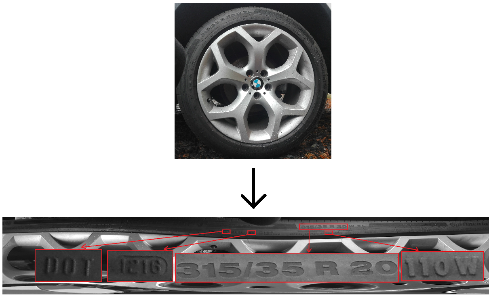
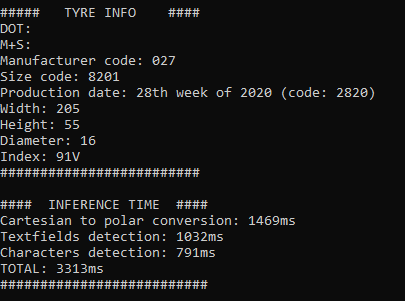
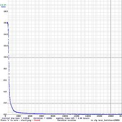
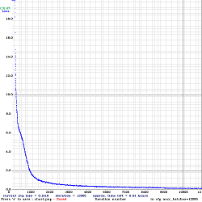

# TyreChecker

Computer vision system for recognition of vehicle tyre markings.

# Purpose of he project

The purpose of the project is to develop a vision system for recognizing tyre markings such as:

- DOT sign
- M+S
- manufacturer code
- size code
- production date
- width
- height
- diameter
- speed and load index

# Overview

Initially, the project was part of an engineering thesis to develop a vision system for recognizing vehicle wheel parameters. A paper based on a thesis is available here
http://pe.org.pl/articles/2022/9/47.pdf. This project is a developement of my part of the thesis. The main goal was to speed up the inference of the system. To achieve this, neural networks were retrained using the darknet framework (https://github.com/AlexeyAB/darknet) and the Google Colab platrorm and the inference program was rewritten in C++. The repository contains the Jupiter Notebook used to train the neural networks, the inference program in C++ and helper functions written in Python for preparing datasets for training.

# Used tools

- C++
- OpenCV
- darknet framework
- Python
- Google Colab

# How it works

## Change of coordinate system

The first step is to change the coordinate system from cartesian to polar. This can be interpreted as "unscrewing" the image. After the change of the coordinate system, the tyre markings are arranged (approximately) horizontally parallel to each other, which allows detection of textfields and characters. An example of the resulting image is shown below:

## Textfields and characters detection

When the coordinate system is changed, textfields detection is performed. The neural network returns the position and type of the text field. Detection is performed on the image at a lower resolution, which speeds up training and inference. Each textfield is extracted from the original high-resolution image. Characters are detected on each of them, which are later converted into text, preserving their order (x-coordinate). The detections are drawn on the image, and the recognized values in text form are printed out in the console. Example is shown below:

# Results

## Neural networks training

To speed up the process of training neural networks, validation was not performed during training, because increasing the subdivisions parameter in the configuration file would be required . Instead, peaks with weights were saved every 1 000 iterations (the file /darknet/src/detector.c was modified), and then a test was performed using each of the saved files.

### Textfields detection:

| Iteration | 1k    | 2k    | 3k    | 4k    | 5k    | 6k    | 7k    | 8k    | 9k    | 10k   | 11k   | 12k   |
| --------- | ----- | ----- | ----- | ----- | ----- | ----- | ----- | ----- | ----- | ----- | ----- | ----- |
| mAP@0.5   | 52.23 | 71.96 | 84.10 | 95.96 | 97.39 | 95.77 | 98.96 | 99.00 | 99.22 | 99.81 | 99.21 | 99.78 |

### Characters detection:

 

 

| Iteration | 1k    | 2k    | 3k    | 4k    | 5k    | 6k    | 7k    | 8k    | 9k    | 10k   | 11k   | 12k   | 13k   | 14k   | 15k   | 16k   | 17k   | 18k   | 19k   | 20k   |
| --------- | ----- | ----- | ----- | ----- | ----- | ----- | ----- | ----- | ----- | ----- | ----- | ----- | ----- | ----- | ----- | ----- | ----- | ----- | ----- | ----- |
| mAP@0.5   | 65.14 | 84.71 | 84.93 | 85.08 | 85.07 | 85.14 | 85.20 | 85.14 | 85.01 | 85.14 | 84.88 | 84.75 | 84.94 | 85.01 | 85.01 | 85.14 | 85.07 | 85.07 | 85.01 | 85.01 |

## Inference times

To test the inference time, 4 trials were conducted using the same photo at different resolutions. The reduction in time is seen during coordinate system change, since the images are rescaled to the same resolution regardless of the resolution of the original image before detecting textfields and characters.

Inference time on CPU i5-6300HQ:

| Resolution [pix] | Coordinate change time [s] | Texfields detection time [s] | Characters detection time [s] | Total time [s] |
| :--------------: | :------------------------: | :--------------------------: | :---------------------------: | :------------: |
|    3104x3104     |            1.70            |             1.16             |             0.82              |      3.71      |
|    2500x2500     |            0.95            |             1.35             |             0.79              |      3.12      |
|    2000x2000     |            0.67            |             1.08             |             0.79              |      2.56      |
|    1500x1500     |            0.37            |             1.13             |             0.79              |      2.30      |

# Future improvements

- better dataset
- use grayscale to speed up
- use yolov7-tiny
